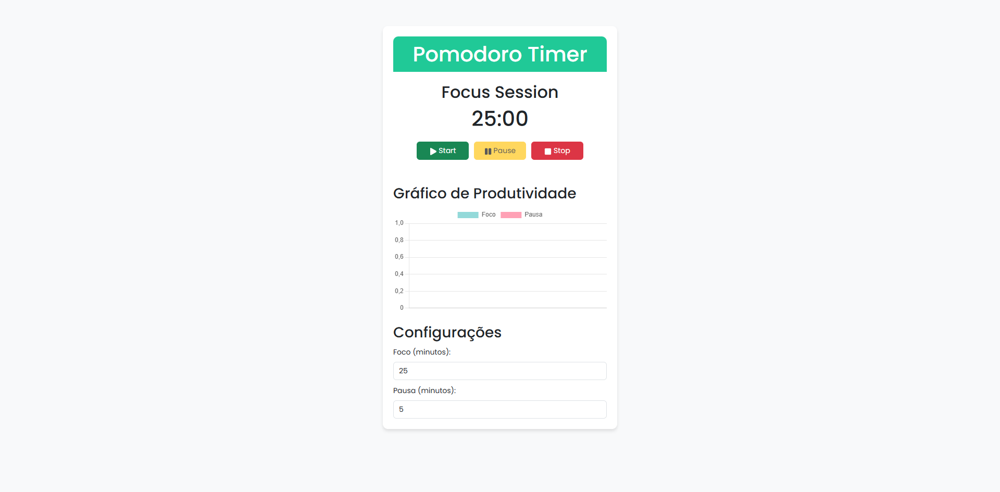

# 🕒 Pomodoro Timer com Relatórios de Produtividade

O **Pomodoro Timer com Relatórios de Produtividade** é uma aplicação web construída com React, Vite e Bootstrap que ajuda você a gerenciar seu tempo usando a técnica Pomodoro. Além disso, ele inclui recursos avançados, como gráficos de produtividade, notificações sonoras e configuração personalizável de tempo.


## 🚀 Funcionalidades Principais

- **Controle Simples**: Inicie, pause ou pare o timer facilmente.
- **Relatórios de Produtividade**: Veja um histórico das suas sessões de foco e pausa.
- **Gráfico Interativo**: Visualize seus progressos em um gráfico de barras.
- **Notificações Sonoras**: Receba alertas ao término de cada sessão.
- **Configuração Personalizável**: Defina o tempo das sessões de foco e pausa conforme sua preferência.
- **Modo Escuro/Luz**: Alterne entre temas claros e escuros para maior conforto visual.
- **Design Compacto e Moderno**: Interface minimalista com tons de teal.

## Demostração




## 📋 Pré-requisitos

Certifique-se de ter os seguintes softwares instalados em sua máquina:

- [Node.js](https://nodejs.org/) (versão 14 ou superior)
- [npm](https://www.npmjs.com/) ou [yarn](https://yarnpkg.com/)


## 🛠️ Como Instalar

Siga os passos abaixo para configurar o projeto localmente:

1. **Clone o repositório:**
   ```bash
   git clone https://github.com/thejessemartins/pomodoro-timer.git
   cd pomodoro-timer
   ```

2. **Instale as dependências:**
   ```bash
   npm install
   ```

3. **Inicie o servidor de desenvolvimento:**
   ```bash
   npm run dev
   ```

4. **Acesse o aplicativo:**
   Abra seu navegador e vá para `http://localhost:3000`.


## 🖥️ Como Usar

1. **Iniciar o Timer:**
   - Clique no botão "Start" para iniciar uma sessão de foco.
   - Quando terminar, automaticamente iniciará uma sessão de pausa.

2. **Configurar o Tempo:**
   - Acesse as configurações para ajustar a duração das sessões de foco e pausa.

3. **Visualizar Relatórios:**
   - O relatório exibe todas as sessões concluídas e seus tempos.
   - O gráfico de barras fornece uma visão rápida da sua produtividade.

4. **Alterar o Tema:**
   - Clique no botão "Modo Escuro" ou "Modo Claro" para alternar entre os temas.


## 🧰 Tecnologias Utilizadas

- **Frontend:**
  - [React](https://reactjs.org/)
  - [Vite](https://vitejs.dev/)
  - [Bootstrap](https://getbootstrap.com/)
  - [Chart.js](https://www.chartjs.org/)

- **Outros:**
  - [Git](https://git-scm.com/)
  - [React Icons](https://react-icons.github.io/react-icons/)


## 🤝 Contribuição

Contribuições são bem-vindas! Se você deseja contribuir para este projeto, siga estas etapas:

1. Faça um fork do repositório.
2. Crie uma nova branch (`git checkout -b feature/nova-funcionalidade`).
3. Faça suas alterações e commit (`git commit -m "Descrição da alteração"`).
4. Envie as alterações (`git push origin feature/nova-funcionalidade`).
5. Abra um Pull Request.


## 📝 Licença

Este projeto está licenciado sob a Licença MIT. Consulte o arquivo [LICENSE](LICENSE) para mais detalhes.


## 👨‍💻 Autor

- GitHub: [@thejessemartins](https://github.com/thejessemartins)
- LinkedIn: [Jessé Martins](https://www.linkedin.com/in/jesse-martins/)

Esperamos que você aproveite o **Pomodoro Timer com Relatórios de Produtividade**! Se tiver dúvidas ou sugestões, sinta-se à vontade para abrir uma issue no repositório. 😊

